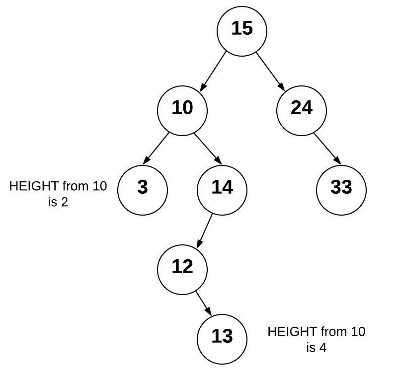

# Tree
## I. What is a tree?
In the realm of computer science and specifically data structures, a tree is a hierarchical tree structure with a root value and then subtrees or "children" that are linked via "nodes"

 In this tutorial we will look at binary trees, binary search trees, and balannced binary search trees

 ## II. Binary Trees
 A binary tree is a basic tree data structure that starts with a root node. The root is only connected to its child nodes. Any child node also has a parent node, but the root node does not have any parent nodes. A binary tree is very similar to a linked list, which means that it is like a doubly linked list with some differences in the heirarchy.

 

 ## III. Binary Search Trees
A binary search tree or BST for short, is essentially a binary tree in structure but follows specific instructions when data is inserted into the tree. Data is typically inserted into the tree by comparing the data with the value in the parent node. If the data is less than that of the parent, it typically goes to the left, if it is greater however, it typically goes to the right.

 

 In this example of a BST, we see that the 24 only has 1 child node, being 33. If a number were to be inserted into the tree that was greater than 15 but less than 24, like say '22', it would be inserted as the left child of the '24' node.

 This example is known as a Balanced Binary Search Tree. The reason it is balanced is because here, the number 15 is placed as the root. But what if the lowest number was the root like 3? what would the tree look like?

 

 Here the tree is unbalanced which is almost no different than a sorted array. The reason this is not optimal is because once the data set gets infinitely large, we have an O(n) data structure that would take forever to insert new values. This is why a Balanced Binary Search Tree is more favorable, resulting in O(log n) time optimization.

 ## IV. Balanced Binary Search Trees
 The simple definition of a Balanced Binary Search Tree is that the subtrees off of the root do not vary greatly in terms of height. For example in the last picture in sectionn 3, we saw the unbalanced tree had the left subtree with 0 length and the right subtree had a length of 6. No data was ever added to the left sub tree! Thus it was unbalanced. Typically any subtree will not be greater than another by 1, so once it is 2 steps lower, there will need to be some sort of rotation or correction that occurs.

 

 A very well known solution to this type of disparity in a BST would be to replace the '14' node with '13', and then make 12 and 14 children of 13. This is known as the AVL algorithm. 

 

 ## V. Inserting into a BST using Python
Inserting into a BST is recursive. So being that it is recursive it requires a base case. The base case is that if there is space to add a node (ie. no children nodes) then we insert. This is based on the value of the data whether it can go on the right or the left.

### Here is an example in python
```
def insert(self, data):
	"""
    base insert function which is used to recursively find the correct position. If the BST is empty then the root will equal the new node.
	"""
	if self.root is None:
		self.root = BST.Node(data)
	else:
		self._insert(data, self.root)  # Start at the root

def _insert(self, data, node):
	"""
	This function looks for a place for the node to be inserted. This function is also invisible to the program, but is called by the base 'insert()' function
	"""
	if data < node.data:
		# The data belongs on the left
		if node.left is None:
			# empty spot
			node.left = BST.Node(data)
		else:
			# No match so we call again
            # staying on the left side of the tree. 
			self._insert(data, node.left)
	elif data >= node.data:
		# The data belongs on the right
		if node.right is None:
			# empty spot so we insert
			node.right = BST.Node(data)
		else:
			# No match so we call again
            # staying on the right side of the tree.
			self._insert(data, node.right)
```
## VI. Example Problem
I have created a Tree Class and will show how I traversed a BST with Preorder Traversal, Post Order Traversal and inorder Traversal

[Link to Example Python file](treesolution.py)
## VII. Problem to Solve

The problems we are going solve are both indepth but also very simple once someone understands the concept of a BST. 

The BST Class will be provided, however 2 functions will be left blank. 

- exists(self,val)
- delete(self, val)
#
[Starting Code](BST.py)

[Link to Solution](BSTsolution.py)
# 
## [Link to return to Welcome Page](Welcome.md)

